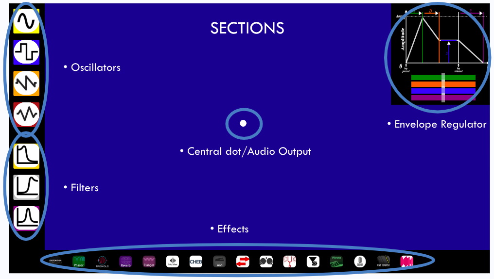

# Online Reactable
## What is an Online Reactable?

The Online Reactable is a version on web page of a reactable, i.e., a real-time intuitive electronical musical instrument consisting in a touch screen surface, which is an interface between the user and the music production, and in buttons representing oscillators, filters and effects. By shifting and chaining buttons on the surface a sound pattern is composed, emulating the behavior of an analogue synthesizer. Parameters can be changed to obtain different kind of results.  

The project has been developed for the course of Advanced Coding Tools and Methodologies for the Music and Acoustic Engineering Master’s degree of the Politecnico di Milano.   
You can find a web-page version of the project and other resources here:  

### [Our Project!](https://onlinereactable.surge.sh "s")
### [Our Presentation!](https://docs.google.com/presentation/d/1iQVu1o2SmSgm0hFCPjxOuq55HptJmsgteYhDYnO7mWo/edit?usp=sharing "s")
### [Demo Video!](https://youtu.be/J2Nzjh6Q07c "s")
### [CodePen!](https://codepen.io/umutus/pen/wvdrMdP?editors=1111 "s")

## How do you use it? 
The Online Reactable is made of a dark blue workspace interface surrounded by black columns that work as menus of oscillators, effects and filters. If buttons are clicked, they are moved into the interface and then they can be dragged by the user.

The buttons can be subdivided in three categories:  
- **Oscillators:** they produce basic waveforms and and initiate the melody 
- **Filters:** they alter the frequency composition of the sound 
- **Effects:** they module sound and add reverb, tremolo, vibrato etc. 

Finally, there is an envelope visualizer to modify the ADSR model of the compositions. 

## Oscilators

The oscillators initiates the melody with the timber of a selected synthesiser. The possible choices are the most common and used waves: 

- **sin**  
- **square**  
- **saw**  
- **triangle**  

Every button is equiped with two knobs that let the user have control over the corresponding effect or sound. 
In the case of the oscillators, the left knob increases the harmonics of the wave. 
The right knob regulates the volume of the sound. 

## Filters

Filters let the user alter the frequency composition of the sound. In this project there are: 

-**low pass filters** 
-**high pass filters** 
-**band pass filters** 

The left knob controls the Q parameter. 
The right knob controls the cut-off frequency in the case of low and high pass filter and the central frequency in the band pass. 

## Effects 

Effects enable the user to alter the produced sound. 
All of the left knobs control a parameter for the specific effect that we thought made the most interesting changes. 
Almost all of the right knobs control the wetness of the signal, that corresponds to how much of the output is the response after the application of the effect with respect to the pure input. 

An exception among the effects to keep in mind is the **DuoSynth**, which behaves similarly to an oscillator. Its left knob regulates the vibrato speed.

All the effects are taken from Tone.js library and the documentation is available online. 

 

#### Every effects' left knob:   

**Distortion:** Distortion level 
**Phaser:** Frequency of the panning effect 
**Vibrato:** Vibrato speed 
**Reverb:** The decay time 
**Bitcrusher:** Bit number of downsampler 
**Chebyshev:** Chebyshev waveshaper order number 
**Autowah:** The base frequency of the bandpass filter 
**Autopanner:** Frequency of panning effect 
**PingPongDelay:** Feedback amount 
**Pitchshift:** Pitch interval 
**Autofilter:** Autofilter frequency 
**Flanger:** Delay time 
**Tremolo:** Rate of the effect 
**Fatsynth:** Spread of each oscillator 

#### Some interesting example usages of effects: 
**Pitchshift:** The user can set the wetness to 50% and set the interval, which creates the sensation of chords. 
**Phaser:** Setting the frequency of the phaser so high that the streo effect becomes a bit percussive and electronic.

## Envelope Regulator

Our Online Reactable offers an option to alter the envelope parameters of the respective synths, via a visual interface where the user can control and visualize the ADSR model on the fly. We used this Codepen as the source code: [ * ](https://codepen.io/ScarpMetal/pen/LyxMGx) 

## Connections and music making

Every button is provided with connection nodes. Oscillators have one for output while filters and effects have one for input and one for output. 
Creating a connection between buttons is done by clicking on the output node of the first button and subsequently on the input one of the second, then a linking line will appear. 
To instead break a connection, it is enough to click again on the output node from which the line was created and it will vanish. 
It is possible to link multiple filters and effects in cascade and thus apply them to the composition. 
However, to obtain sound in output, the user must always create an eventual connection between a oscillator button and the white node located at the very center of the workspace. 
This interface implementation of the Online Reactable serves foremost as a tool for experimenting with musical timbre, textures and overall interesting effects using a simple and intuitive environment. 

## How is Audio Created?

We used Tone.js, for effects, timing the melody, and Audio Context handling.[ * ](https://tonejs.github.io/)
We also needed a wrapper class for Tone.js to bypass elements on the fly.[ * ](https://github.com/Tonejs/Tone.js/issues/187#issuecomment-705409761) 
The project also uses Pure-knob library[ * ](https://www.cssscript.com/canvas-javascript-knob-dial-component/) for drawing the knobs to change the parameters of each button. This library is under Apache v2 license.[ * ](http://www.apache.org/licenses/LICENSE-2.0). We partially customized it. 
We used a helper envelope function that lets us change envelope on the fly.[ * ](https://codepen.io/ScarpMetal/pen/LyxMGx) 
Finally, we wrote the custom functions for the connections. 

## Audio Context Handling
Every time a connection is made between two buttons, the ‘model’ array keeps track of what is connected to what.
The model is checked constantly if an oscillator is present.
If yes, the oscillator and its type is defined and the melody is initiated.
After each connection, the function identify the button id’s and the audio context objects relating to those id’s. 
Connects those id’s until it reaches to the output node.
Tone.js ‘connect’ method is used to handle the audio context connections.[ * ](https://tonejs.github.io/docs/14.7.77/ToneAudioNode#connect)  

 
Conversely, when a line is destroyed or the button is destroyed, every audio context object associated are detected and are disconnected.
Tone.js ‘disconnect’ method is used.[ * ](https://tonejs.github.io/docs/14.7.77/ToneAudioNode#disconnect)

## Knobs 
We used an open source library for a knob implementation that allows to change their values on the fly with an user input.  
We partially altered the library so that the knobs move accordingly to the associated buttons. We also added a few properties, such as IDs for defining which knob correspond to which effect.[ * ](https://www.cssscript.com/canvas-javascript-knob-dial-component/)

 
 

## Files
_Web Reactable_ is composed of:

- **index.html**
contains the main layout of the interface, the embedding of the script components, the CSS file and the libraries.
- **main.js**
contains the main functions and the application of Tone.js and other dependencies

- **styles.css**
contains the styling of the application

## Dependencies

- [**React**]: Structure of the web page and of the view.
- [**Tone.js**]: A web audio framework for the intuitive creation of interactive music in the web, version: 14.8.26.
- [**jQuery**]: Library that simplifies communication between html and JS and is optimal for event handling and animation.

©

## Authors
Umut Fidan 
Roberto Leone Cicognani 
Claudio César Armas Monroy 
