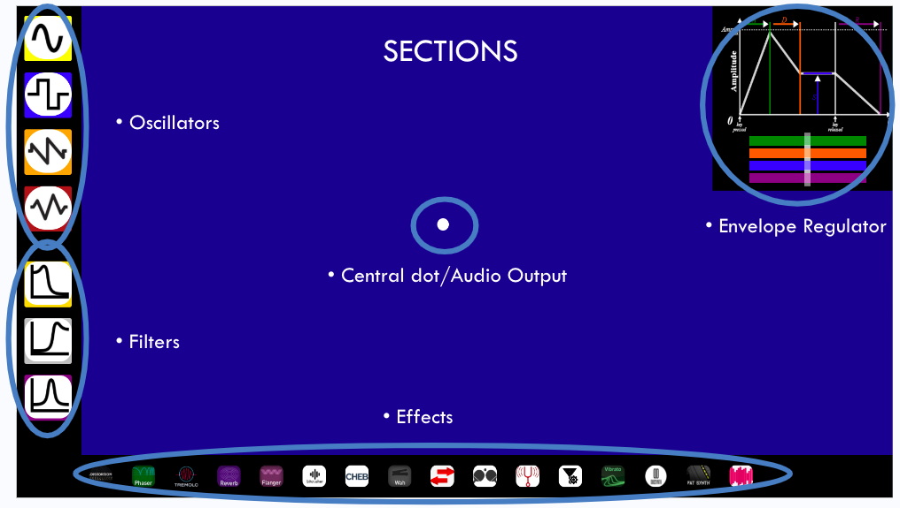
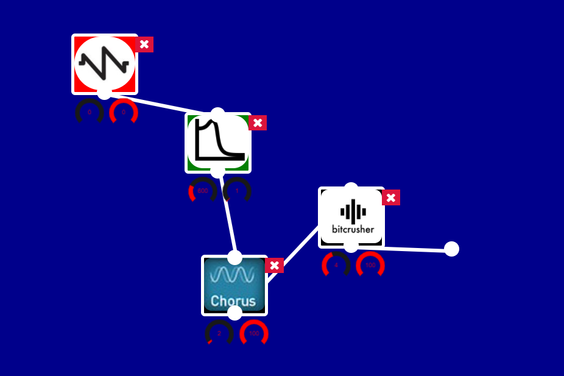

# Online Reactable
## What is an Online Reactable?

The Online Reactable is the recreation of a reactable on a web page that allows the user to create & combine sound waves, filters and effects in real time in an intuitive way. 

The original Reactable is an electronical musical instrument that lets the user create music by choosing buttons and putting them on an electronic table whose surface is a touch screen to change the effect parameters. Objects of oscillators and effects are selected and moved to generate a sound pattern, emulating the behavior of an analogue synthesizer. Parameters can be changed to obtain different kind of results and usually the production of music is accompanied by light effects. 

Our goal was to implement the physical Reactable on a web page so that it is more portable and accessible to all. The project has been developed for the course of Advanced Coding Tools and Methodologies for the Music and Acoustic Engineering Master’s degree of the Politecnico di Milano. 

## How do you use it? 
The Online Reactable is made of a dark blue workspace interface surrounded by black columns that work as menus of oscillators, effects and filters. It is possible to include these buttons into the interface by clicking on them and connecting them to create interesting combinations.

The buttons can be subdivided in three categories: 
-Oscillators, produces basic waveforms and and initiates the melody
-Filters, which can alter the frequency composition of the sound
-Effects, that can module sound and add reverb, tremolo, vibrato etc. 
-Envelope visulaizer 

## Oscilator Buttons
The oscillators initiates the melody with the timber of a chosen synthesiser, It is possible to choose between the most common and used waves and filters so: 
- **sin, square, saw** and **triangle waves** Under the effects there is also **Duo synth** that can be used similarly. 

Every button is equiped with two knobs that let the user have control over the corresponding effect or sound.
The left knob increases the harmonics of the wave, and for Duo Synth it increases the vibrato speed.
The right knob regulates the volume of the sound.

## Filters

Filters lets us alter the frequency composition of the sound. There are 3 filter definitions in the project:
-**low, high** and **band pass filters.**
The left knob controls the Q parameter. Normally this only controls the When this parameter is very high very fun stuff happens! The Right knob controls the cut-off frequency and in the case of band pass, it controls the central frequency of the filter.

## Effects 
Effect buttons enable the user to change and alter the sound by cascading different effects together. All of the left knobs control a parameter for the effect that we thought made the most interesting changes. Almost all of the right knobs control the wetness of the signal, meaning how much of the output is the filtered response and how much it is the pure input. All the effects are taken from Tone.js library and the documentation is available online.

&nbsp;&nbsp;Every effects' left knob:   
Distortion: Distortion level 
Phaser: Frequency of the panning effect 
Vibrato: Speed of the vibrato 
Reverb: The decay time 
Bitcrusher: Bit number of downsampler 
Chebyshev: Chebyshev waveshaper order number 
Autowah: The basefrequency of the bandpass filter 
Autopanner: Frequency of panning effect 
PingpongDelay: Feedback amount 
Pitchshift: Pitch interval 
Autofilter: Frequency of the autofilter 
Flanger: Delay time 
Tremolo: Rate of the effect 

&nbsp;&nbsp;Some interesting example usages of effects:  
Pitchshift: The user can set the wetness to 50% and set the interval which creates the sensation of chords. 
Phaser: Setting the frequency of the phaser so high that the streo effect becomes a bit percussive and electronic.

## Envelope Regulator
The interface offers an option to alter the envelope parameters of the respective synths, via a visual interface in which the user can control and visualize the ADSR parameters on the fly.

## Movement and connecting lines
To obtain sound in output the user must create an eventual connection between the oscillator buttons and the output node, located at the very center of the workspace.
Every button is provided with connection nodes from which a line can be drawn. Oscillator nodes have one node for output while filters and effects have one input and one output. Creating a connection between buttons is easy: one must click on the output node of the first button and subsequently click the input node of the button to which the connection should arrive. To break the connection, it is enough to click again on the output node from which the line was created and the connection will vanish.

## Making music
If the user wishes to hear a melody with the unaltered sound from the oscillator he must connect the corresponding button directly to the output node, otherwise they can connect it to an effect and have this last one be connected to the general output. It is possible to have multiple in effects in cascade.
The user has control over several factors that include oscillator types, filters, and effects, and can combine and arrange them to obtain musical outputs with different sonic characteristics. The Web React table serves foremost as a tool for experimenting with musical timbre, textures and overall interesting effects using a simple and intuitive environment.

## How is Audio Created?
We used Tone.js, for effects, timing the melody, and Audio Context handling [ * ](https://tonejs.github.io/)
We also needed a wrapper class for Tone.js for bypassing elements on the fly [ * ](https://github.com/Tonejs/Tone.js/issues/187#issuecomment-705409761)
Pure-knob library for creating/drawing the knobs, for changing the parameters of each button, partially customized by us [ * ](https://www.cssscript.com/canvas-javascript-knob-dial-component/)
A helper envelope function that lets us change envelope on the fly [ * ](https://codepen.io/ScarpMetal/pen/LyxMGx)
Custom functions that we wrote that connects everything

## Audio Context Handling, Create lines
Every time a connection is made between two buttons, the ‘model’ array keeps track of what is connected to what.
The model is checked constantly if an oscillator is present.
If yes, the oscillator and its type is defined and the melody is initiated.
After each connection, the function identify the button id’s and the audio context objects relating to those id’s. 
Connects those id’s until it reaches to the output node.
Tone.js ‘connect’ method is used to handle the audio context connections. [ * ](https://tonejs.github.io/docs/14.7.77/ToneAudioNode#connect)

## Audio Context Handling, Destroy lines

Conversely, when a line is destroyed or the button is destroyed, every audio context object associated are detected and are disconnected.
Tone.js ‘disconnect’ method is used [ * ](https://tonejs.github.io/docs/14.7.77/ToneAudioNode#disconnect)

## Files
_Web Reactable_ is composed of:

- **index.html**
- **main.js**
contains the main js file, with all the functions and dependencies components

- styles.css contains the styling of the application

## Dependencies

- [**React**]: structure of the web page and of the View.
- [**Tone.js**]: a web audio framework for creating interactive music in the web intuitively.
- [**jQuery**]Library that facilitates communication between html and JS and is optimal for event handling and animation.

## [Our presentation!](https://docs.google.com/presentation/d/1iQVu1o2SmSgm0hFCPjxOuq55HptJmsgteYhDYnO7mWo/edit?usp=sharing "s")

## Authors
Umut Fidan 
Roberto Leone Cicognani 
Claudio César Armas Monroy 
